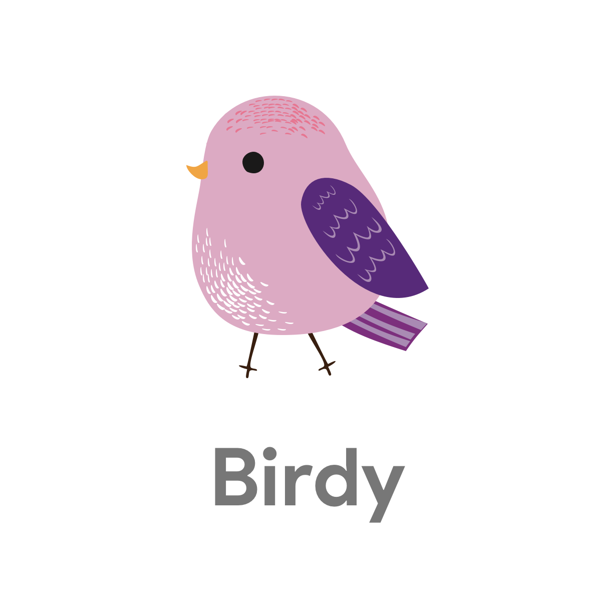

A chrome extension to keep you educated about your browsing details and advises you when you lose focus

<!-- <h3 align="center">
Wireframes
</h3> -->

## Screenshots
<!-- 

 -->

<!-- ## TODO

- [x] <b>Design</b>
    - [x] Wireframes 
        - Brainstorm and draw the skeletal structure of the mobile app
        - [x] Research user stories for the app
        - [x] :star: Sketch Prototypes - Make high fidelity prototypes using Sketch
        - [x] :star: Logo - Make a logo

- <b>API's</b>
    - [Foursquare](https://developer.foursquare.com/) 
    - Google Map 
    - [Facebook OAuth](https://developers.facebook.com/docs/facebook-login/web) 

- [x] <b>Navigation </b>
    - [x] Navigation Tree Structure  
    - [x] Build Empty Screens -->
    
-  <b>Stack Used</b>
    
## Team Members
- [Bhavesh Chowdhury](https://github.com/bhaveshc789) 

